<div align="center">

<picture>
  <source media="(max-width: 600px)" srcset="https://raw.githubusercontent.com/jpinchi/printer-device-manager/main/docs/readme/banner-m.svg" />
  
</picture>

<br/>

[](LICENSE)
[](#como-funciona)
[](#como-probarlo)
[](#como-funciona)
[](#como-funciona)
[](#calidad)

<br/>

<a href="#galeria"></a>
<a href="#como-probarlo"></a>
<a href="#como-funciona"></a>

</div>

<br/>

<a id="que-es"></a>

<picture>
  <source media="(max-width: 600px)" srcset="https://raw.githubusercontent.com/jpinchi/printer-device-manager/main/docs/readme/h-que-es-m.svg" />
  
</picture>

**Printer Device Manager** es una aplicación local que **encuentra las impresoras de tu red por SNMP** y te muestra, en un panel claro, cómo está cada una: en línea o apagada, cuánto tóner le queda por color, cuántas páginas lleva y qué alertas tiene.

Está pensado para **equipos de soporte y TI** que administran muchas impresoras repartidas en varias sedes y quieren verlas todas juntas, sin instalar nada pesado ni abrir una por una en su navegador.

<picture>
  <source media="(max-width: 600px)" srcset="https://raw.githubusercontent.com/jpinchi/printer-device-manager/main/docs/readme/indicadores-m.svg" />
  
</picture>

<details>
<summary><b>🇬🇧 In English (short summary)</b></summary>

**Printer Device Manager** is a local app that **discovers network printers over SNMP** and shows their health in one clean dashboard: online/offline status, per-color toner levels, page counters and alerts. It's built for IT/support teams managing large printer fleets across multiple sites. Everything (static frontend + API + live WebSocket) is served from a **single LAN address**, with a desktop app, a central/hub model for multiple branches, light/dark themes, Spanish/English UI, role-based auth, and PDF/Excel/CSV reports. Stack: TypeScript, Express 5, Prisma + SQLite, Next.js 15 / React 19, Electron 44. 140 passing tests.
</details>

<br/>

<a id="galeria"></a>

<picture>
  <source media="(max-width: 600px)" srcset="https://raw.githubusercontent.com/jpinchi/printer-device-manager/main/docs/readme/h-galeria-m.svg" />
  
</picture>

<picture>
  <source media="(max-width: 600px)" srcset="https://raw.githubusercontent.com/jpinchi/printer-device-manager/main/docs/readme/galeria-m.svg" />
  
</picture>

<details>
<summary><b>Ver las capturas en tamaño completo</b></summary>

<br/>

<table>
  <tr>
    <td align="center" width="50%">
      <br/>
      <sub><b>Panel principal</b> — resumen y tabla (modo oscuro)</sub>
    </td>
    <td align="center" width="50%">
      <br/>
      <sub><b>Panel principal</b> — resumen y tabla (modo claro)</sub>
    </td>
  </tr>
  <tr>
    <td align="center" width="50%">
      <br/>
      <sub><b>Ficha de impresora</b> — consumibles, contadores y red</sub>
    </td>
    <td align="center" width="50%">
      <br/>
      <sub><b>Consumibles</b> — tóner de toda la flota</sub>
    </td>
  </tr>
  <tr>
    <td align="center" width="50%">
      <br/>
      <sub><b>Reportes</b> — exporta en PDF, Excel o CSV</sub>
    </td>
    <td></td>
  </tr>
</table>

</details>

> Las capturas usan **datos de ejemplo inventados** (IPs, modelos y ubicaciones ficticios). Se regeneran con el script de la sección [Cómo funciona](#como-funciona).

<br/>

<a id="funciones"></a>

<picture>
  <source media="(max-width: 600px)" srcset="https://raw.githubusercontent.com/jpinchi/printer-device-manager/main/docs/readme/h-funciones-m.svg" />
  
</picture>

<picture>
  <source media="(max-width: 600px)" srcset="https://raw.githubusercontent.com/jpinchi/printer-device-manager/main/docs/readme/funciones-m.svg" />
  
</picture>

<br/><br/>

<a id="como-probarlo"></a>

<picture>
  <source media="(max-width: 600px)" srcset="https://raw.githubusercontent.com/jpinchi/printer-device-manager/main/docs/readme/h-como-probarlo-m.svg" />
  
</picture>

Necesitas **Node.js ≥ 20**. No hace falta una impresora: hay un **modo de simulación** y un **script de datos de ejemplo**.

```bash
# 1) Clonar e instalar
git clone https://github.com/jpinchi/printer-device-manager.git
cd printer-device-manager
npm install

# 2) Configurar y preparar la base de datos
cp .env.example .env
npm run db:generate
npm run db:push

# 3) Compilar el panel web
npm run build:web
```

**Opción A — ver el panel lleno con datos de ejemplo:**

```bash
# Siembra datos ficticios en una base de datos de demostración
DATABASE_URL="file:./prisma/demo.db" node scripts/demo-seed.mjs
# Arranca todo en una sola dirección
DATABASE_URL="file:./prisma/demo.db" AUTH_ENFORCE=false npm run serve
# Abre http://localhost:2626
```

**Opción B — probar el flujo SNMP sin hardware (simulación):**

```bash
SNMP_MOCK=true AUTH_ENFORCE=false npm run server
# Abre http://localhost:3000, escribe cualquier IP y pulsa "Agregar por SNMP"
```

> En Windows (PowerShell) las variables van antes, p. ej.:
> `$env:DATABASE_URL="file:./prisma/demo.db"; node scripts/demo-seed.mjs`

<br/>

<a id="como-funciona"></a>

<picture>
  <source media="(max-width: 600px)" srcset="https://raw.githubusercontent.com/jpinchi/printer-device-manager/main/docs/readme/h-como-funciona-m.svg" />
  
</picture>

El frontend se compila a estático y **el mismo servidor Express sirve la web, la API y el WebSocket** en un solo puerto. Así cualquier equipo de la red entra por una única dirección, sin CORS ni procesos separados.

<picture>
  <source media="(max-width: 600px)" srcset="https://raw.githubusercontent.com/jpinchi/printer-device-manager/main/docs/readme/arquitectura-m.svg" />
  
</picture>

<picture>
  <source media="(max-width: 600px)" srcset="https://raw.githubusercontent.com/jpinchi/printer-device-manager/main/docs/readme/tecnologias-m.svg" />
  
</picture>

Para generar las capturas de nuevo: `node scripts/capture-screenshots.mjs` (siembra datos de ejemplo, arranca el servidor, captura con Chrome y optimiza las imágenes).

<br/>

<a id="retos"></a>

<picture>
  <source media="(max-width: 600px)" srcset="https://raw.githubusercontent.com/jpinchi/printer-device-manager/main/docs/readme/h-retos-m.svg" />
  
</picture>

- **Una sola dirección para todo (sin CORS).** En vez de un servidor para la API y otro para la web, el frontend se exporta estático y Express lo sirve junto con la API y el WebSocket en un puerto. Resultado: desplegar en una red es `npm run serve` y entrar por `http://IP:2626`, sin configurar orígenes cruzados.
- **SNMP multi‑fabricante normalizado.** Cada marca reporta sus datos distinto. Se resolvió con un `PrinterAdapter` por fabricante y un **adaptador estándar de respaldo**, de modo que una RICOH, una HP y una Brother se ven iguales en la tabla (tóner por color, contadores, estado).
- **Multi‑sede con auto‑actualización headless.** El auto‑update de Electron es para la ventana gráfica; los servidores de sede ("hubs") corren sin interfaz como tarea de Windows. Se les añadió su propio mecanismo que consulta un feed central, descarga el instalador y se reinstala/reinicia solo.
- **Diálogos propios en lugar de los nativos.** En Electron, `window.confirm`/`alert` roban el foco y dejan los campos sin aceptar teclado. Se reemplazaron por un modal de React, así el foco nunca se pierde tras confirmar o cancelar.

<br/>

<a id="calidad"></a>

<picture>
  <source media="(max-width: 600px)" srcset="https://raw.githubusercontent.com/jpinchi/printer-device-manager/main/docs/readme/h-calidad-m.svg" />
  
</picture>

<picture>
  <source media="(max-width: 600px)" srcset="https://raw.githubusercontent.com/jpinchi/printer-device-manager/main/docs/readme/calidad-m.svg" />
  
</picture>

- Las pruebas se corren con `npm test`, después del paso 2 de [Cómo probarlo](#como-probarlo).
- Los secretos (la *community* SNMP de cada impresora, la contraseña SMTP y la que usa cada sede para conectarse al servidor central) se cifran con AES-256-GCM: ver `apps/server/src/secrets.ts` y su prueba.
- Los roles se activan con `AUTH_ENFORCE=true`.

<br/>

<a id="proximos"></a>

<picture>
  <source media="(max-width: 600px)" srcset="https://raw.githubusercontent.com/jpinchi/printer-device-manager/main/docs/readme/h-proximos-m.svg" />
  
</picture>

- Más adaptadores de fabricantes sobre el adaptador estándar.
- Migración opcional a PostgreSQL (el esquema ya está preparado para cambiar de proveedor).
- Alertas por correo (la configuración SMTP ya existe en Ajustes).

<br/>

<picture>
  <source media="(max-width: 600px)" srcset="https://raw.githubusercontent.com/jpinchi/printer-device-manager/main/docs/readme/pie-m.svg" />
  
</picture>

<div align="center">

Distribuido bajo licencia **MIT** — ver [`LICENSE`](LICENSE) · [github.com/jpinchi](https://github.com/jpinchi)

</div>
