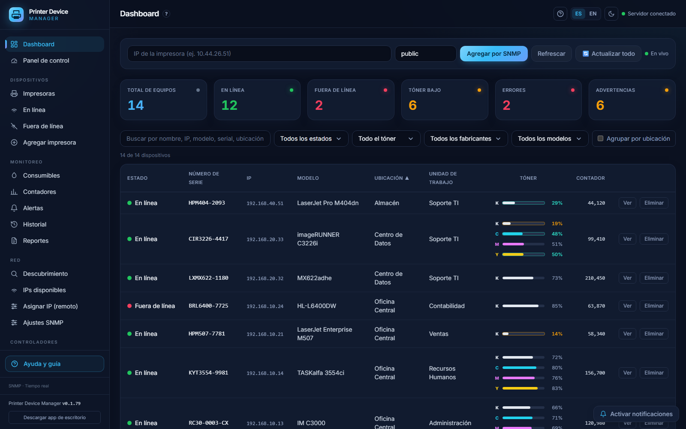
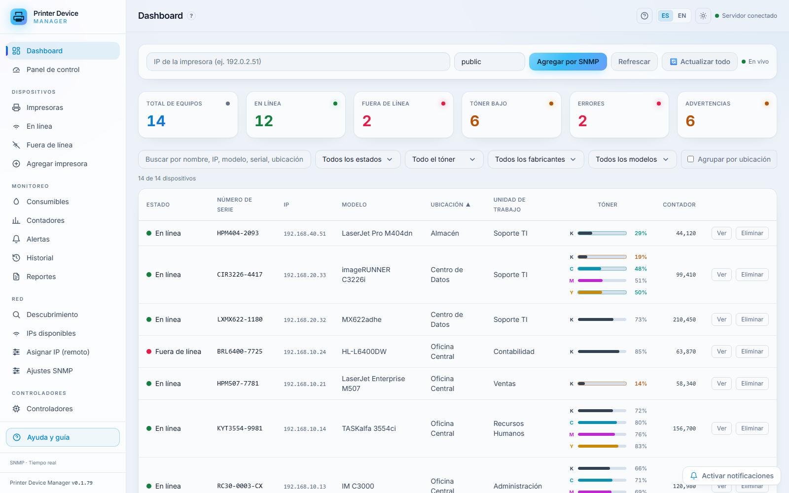
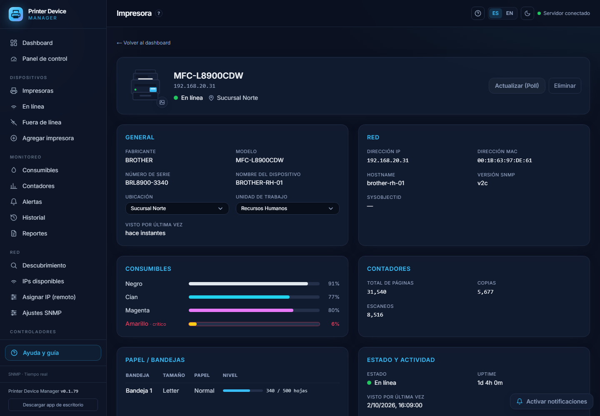
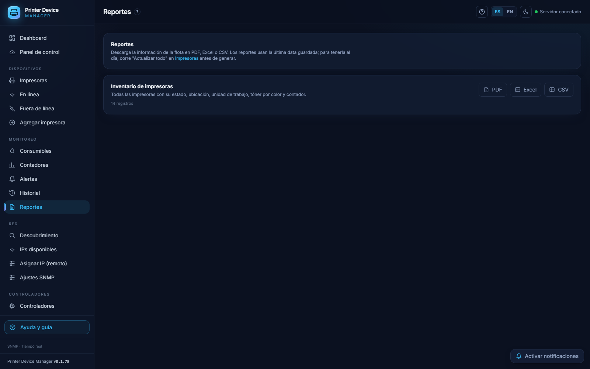
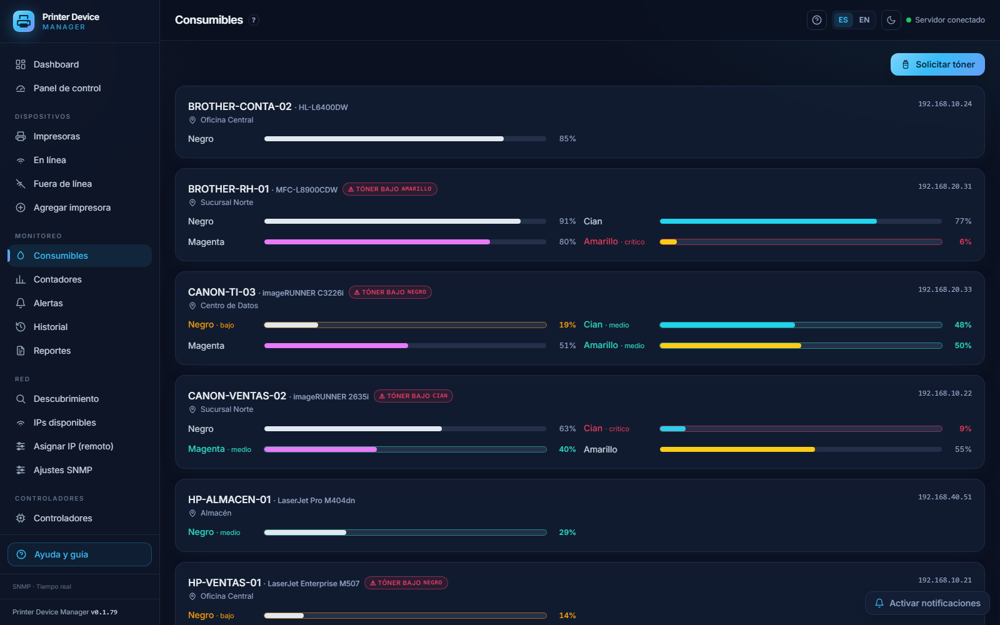
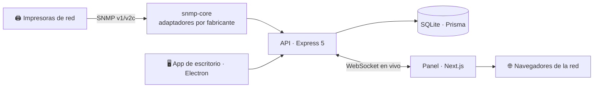

<div align="center">

# 🖨️ Printer Device Manager

### Descubre, monitorea y administra toda tu flota de impresoras de red desde un solo lugar.

[](LICENSE)
[](#-cómo-funciona-por-dentro)
[](#-cómo-probarlo)
[](#-cómo-funciona-por-dentro)
[](#-cómo-funciona-por-dentro)
[](#-calidad)

**[Ver capturas](#-galería) · [Cómo probarlo](#-cómo-probarlo) · [Cómo funciona](#-cómo-funciona-por-dentro)**

<br/>



</div>

---

## ✨ ¿Qué es y para quién?

**Printer Device Manager** es una aplicación local que **encuentra las impresoras de tu red por SNMP** y te muestra, en un panel claro, cómo está cada una: en línea o apagada, cuánto tóner le queda por color, cuántas páginas lleva y qué alertas tiene.

Está pensado para **equipos de soporte y TI** que administran muchas impresoras repartidas en varias sedes y quieren verlas todas juntas, sin instalar nada pesado ni abrir una por una en su navegador.

<details>
<summary><b>🇬🇧 In English (short summary)</b></summary>

**Printer Device Manager** is a local app that **discovers network printers over SNMP** and shows their health in one clean dashboard: online/offline status, per-color toner levels, page counters and alerts. It's built for IT/support teams managing large printer fleets across multiple sites. Everything (static frontend + API + live WebSocket) is served from a **single LAN address**, with a desktop app, a central/hub model for multiple branches, light/dark themes, Spanish/English UI, role-based auth, and PDF/Excel/CSV reports. Stack: TypeScript, Express 5, Prisma + SQLite, Next.js 15 / React 19, Electron 44. 130 passing tests.
</details>

---

## 🚀 Funciones destacadas

- 🔎 **Descubrimiento por SNMP** — escanea un rango de IPs y agrega las impresoras solas; tú no capturas nada a mano.
- 📊 **Panel en vivo** — estado, tóner y contadores se actualizan en tiempo real por WebSocket, sin recargar la página.
- 🎨 **Tóner por color** — ve el nivel real de K/C/M/Y de cada equipo y detecta de un vistazo cuál está por agotarse.
- 🔔 **Alertas automáticas** — avisa cuando una impresora cae o el tóner baja de un umbral que tú defines.
- 🗂️ **Organización por ubicación y unidad de trabajo** — clasifica la flota por sede y por área, y filtra al instante.
- 📄 **Reportes en PDF, Excel y CSV** — exporta el inventario con la última data, listo para enviar o archivar.
- 🌐 **Una sola dirección para todos** — todo (web + API + tiempo real) corre en un puerto: `http://IP:2626` desde cualquier PC de la red.
- 🏢 **Modelo central/hub multi-sede** — cada sede corre su propio servidor y se mantiene al día con auto-actualización.
- 🖥️ **App de escritorio (Windows)** — instalador propio con actualizaciones automáticas.
- 🌓 **Modo claro/oscuro y español/inglés** — el panel se adapta al gusto de cada quien.

---

## 🖼️ Galería

<table>
  <tr>
    <td align="center" width="50%">
      <br/>
      <sub><b>Panel principal</b> — resumen y tabla (modo claro)</sub>
    </td>
    <td align="center" width="50%">
      <br/>
      <sub><b>Ficha de impresora</b> — consumibles, contadores y red</sub>
    </td>
  </tr>
  <tr>
    <td align="center" width="50%">
      <br/>
      <sub><b>Reportes</b> — exporta en PDF, Excel o CSV</sub>
    </td>
    <td align="center" width="50%">
      <br/>
      <sub><b>Consumibles</b> — tóner de toda la flota</sub>
    </td>
  </tr>
</table>

> Las capturas usan **datos de ejemplo inventados** (IPs, modelos y ubicaciones ficticios). Se regeneran con el script de la sección [Cómo funciona](#-cómo-funciona-por-dentro).

---

## 🧪 Cómo probarlo

Necesitas **Node.js ≥ 20**. No hace falta una impresora: hay un **modo de simulación** y un **script de datos de ejemplo**.

```bash
# 1) Clonar e instalar
git clone https://github.com/jpinchi/printer-device-manager.git
cd printer-device-manager
npm install

# 2) Configurar y preparar la base de datos
cp .env.example .env
npm run db:generate
npm run db:push

# 3) Compilar el panel web
npm run build:web
```

**Opción A — ver el panel lleno con datos de ejemplo:**

```bash
# Siembra datos ficticios en una base de datos de demostración
DATABASE_URL="file:./prisma/demo.db" node scripts/demo-seed.mjs
# Arranca todo en una sola dirección
DATABASE_URL="file:./prisma/demo.db" AUTH_ENFORCE=false npm run serve
# Abre http://localhost:2626
```

**Opción B — probar el flujo SNMP sin hardware (simulación):**

```bash
SNMP_MOCK=true AUTH_ENFORCE=false npm run server
# Abre http://localhost:3000, escribe cualquier IP y pulsa "Agregar por SNMP"
```

> En Windows (PowerShell) las variables van antes, p. ej.:
> `$env:DATABASE_URL="file:./prisma/demo.db"; node scripts/demo-seed.mjs`

---

## 🔧 Cómo funciona por dentro

El frontend se compila a estático y **el mismo servidor Express sirve la web, la API y el WebSocket** en un solo puerto. Así cualquier equipo de la red entra por una única dirección, sin CORS ni procesos separados.



| Capa | Tecnologías |
|------|-------------|
| **Frontend** | Next.js 15, React 19, Tailwind CSS, TypeScript |
| **Backend** | Express 5, Prisma 6, SQLite, WebSocket (`ws`) |
| **SNMP** | `net-snmp` + adaptadores propios (RICOH, HP, Canon, Brother, Kyocera, Xerox, Lexmark + estándar) |
| **Escritorio** | Electron 44, electron-builder, electron-updater |
| **Runtime** | Node.js ≥ 20 · monorepo con workspaces de npm |
| **Pruebas** | Vitest (130 pruebas) |

Para generar las capturas de nuevo: `node scripts/capture-screenshots.mjs` (siembra datos de ejemplo, arranca el servidor, captura con Chrome y optimiza las imágenes).

---

## 🧩 Retos y decisiones de diseño

- **Una sola dirección para todo (sin CORS).** En vez de un servidor para la API y otro para la web, el frontend se exporta estático y Express lo sirve junto con la API y el WebSocket en un puerto. Resultado: desplegar en una red es `npm run serve` y entrar por `http://IP:2626`, sin configurar orígenes cruzados.
- **SNMP multi‑fabricante normalizado.** Cada marca reporta sus datos distinto. Se resolvió con un `PrinterAdapter` por fabricante y un **adaptador estándar de respaldo**, de modo que una RICOH, una HP y una Brother se ven iguales en la tabla (tóner por color, contadores, estado).
- **Multi‑sede con auto‑actualización headless.** El auto‑update de Electron es para la ventana gráfica; los servidores de sede ("hubs") corren sin interfaz como tarea de Windows. Se les añadió su propio mecanismo que consulta un feed central, descarga el instalador y se reinstala/reinicia solo.
- **Diálogos propios en lugar de los nativos.** En Electron, `window.confirm`/`alert` roban el foco y dejan los campos sin aceptar teclado. Se reemplazaron por un modal de React, así el foco nunca se pierde tras confirmar o cancelar.

---

## ✅ Calidad

- **130 pruebas automatizadas** con Vitest (`npm test`): parsers SNMP, descubrimiento, polling, autenticación, *rate‑limiting* y cifrado de secretos.
- **Secretos cifrados en reposo:** la *community* SNMP se guarda cifrada y **nunca** se expone al frontend (ver `apps/server/src/secrets.ts` y su prueba).
- **Login protegido:** límite de intentos (*rate‑limit*) y **roles** (Administrador / Técnico / Observador) activables con `AUTH_ENFORCE=true`.
- **Accesible y responsivo:** modo claro/oscuro, español/inglés y diseño que funciona en teléfono.

---

## 🗺️ Próximos pasos

- Más adaptadores de fabricantes sobre el adaptador estándar.
- Migración opcional a PostgreSQL (el esquema ya está preparado para cambiar de proveedor).
- Alertas por correo (la configuración SMTP ya existe en Ajustes).

---

## 📄 Licencia

Distribuido bajo licencia **MIT**. Ver [`LICENSE`](LICENSE).

---

## 👤 Contacto

Hecho por **jpinchi** — [github.com/jpinchi](https://github.com/jpinchi)
